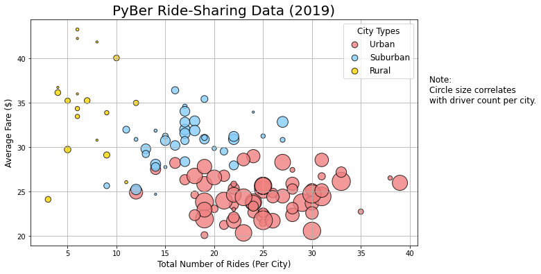
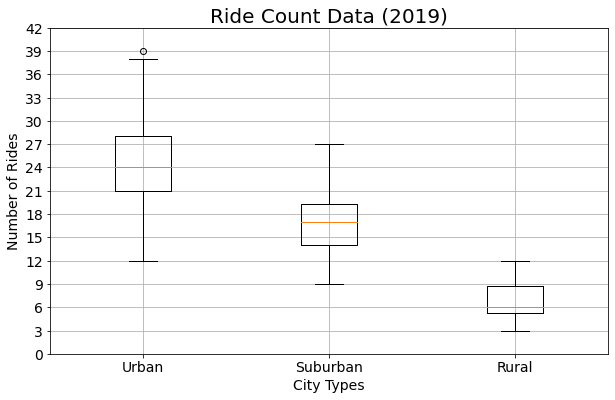
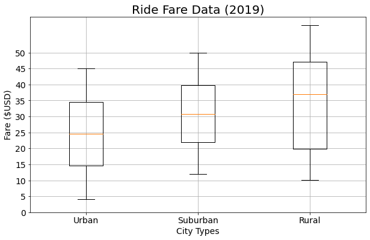
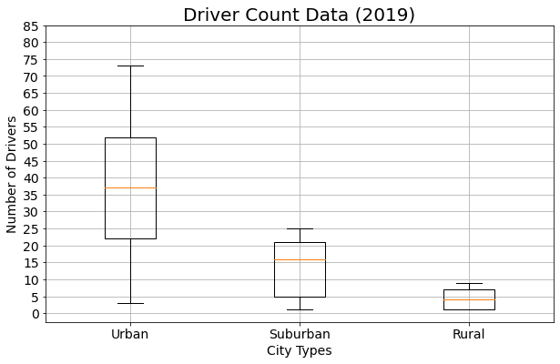
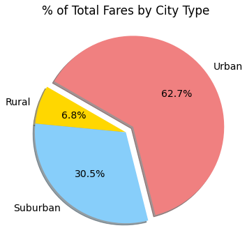
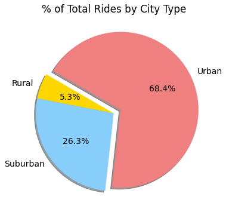
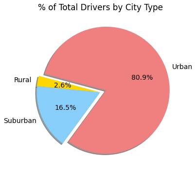
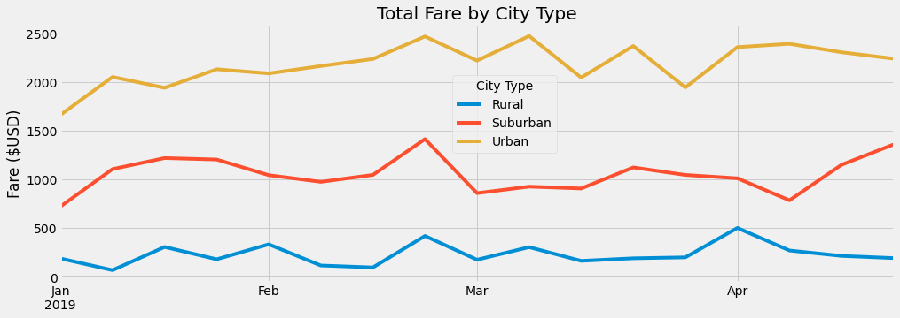

# PyBer Analysis

## Overview of the analysis:

The purpose of this project is to perform an exploratory analysis and create compelling visualizations of rideshare data from January to early May 2019 for PyBer, to help improve access to ride sharing services and determine affordability in underserved neighborhoods.  Specifically, the analysis is to compare the relationship between the type of city and the number of drivers and riders as well as calcuate the total fares, drivers and riders per city type.  The deliverables from the analysis are as follows:

   1. Summary of ride sharing data by city type.
   2. A bubble chart that visualizes the average fare versus the total number of rides with bubble size based on the total number of drivers for each city type.
   3. Mean, median, and mode for each city type for the following:
        1. Number of rides
        2. Fare prices
        3. Number of drivers
   4. Box-and-whisker plots that visualize each of the following for each city type to determine if there are any outliers:
        1. Number of rides
        2. Fare prices
        3. Number of drivers
   5. Pie charts that visualizes each of the following data for each city type:
        1. Percent of total fares
        2. Percent of total rides
        3. Percent of total drivers
   6. A line chart that visualizes the total weekly fares for each city type. 

## Resources:
* Data sorces: city_data.csv, ride_data.csv
* Software: Python 3.8.3, Jupyter Notebook (anaconda3)

## Results: Using images from the summary DataFrame and multiple-line chart, describe the differences in ride-sharing data among the different city types.

The results of the ride sharing analysis summary below show that ride sharing is much more common and quite a bit cheaper in urban areas than in suburban or rural areas.  For the time period of January 2019 to early May 2019 captured by the data, there were 1,625 total rides shared in urban cities and only 125 in rural cities.  When comparing the total number of drivers in each city type, the data showed that urban cities had far more drivers (2,405) than suburban (490) or rural (78) cities.  In fact, urban cities were the only city type that had more drivers than total rides for the time period analyzed.  Additionally, from the summary the data shows that urban cities brought in 2 times as much fare revenue as suburban cities and 9 times as much as rural cities, but the average fare per ride is actually lowest in urban cities.

| a | b | c |
|:----|:----|:----|
|  |  |  |

| a | b | c |
|:----|:----|:----|
|  |  |  |

## Summary: Based on the results, provide three business recommendations to the CEO for addressing any disparities among the city types.

Based on the data, I have three business recommendations to address disparities among the city types.  My recommendations are as follows:
  1. Reduce the number of drivers in urban cities. - There are more drivers in urban cities than there are total rides which is driving the average fare per driver way down and likely also reducing the  
  2. Increase fares in urban cities. - There seems to be a higher demand for ride sharing in urban areas 
  3. Reduce fares in suburban and rural cities. - 
